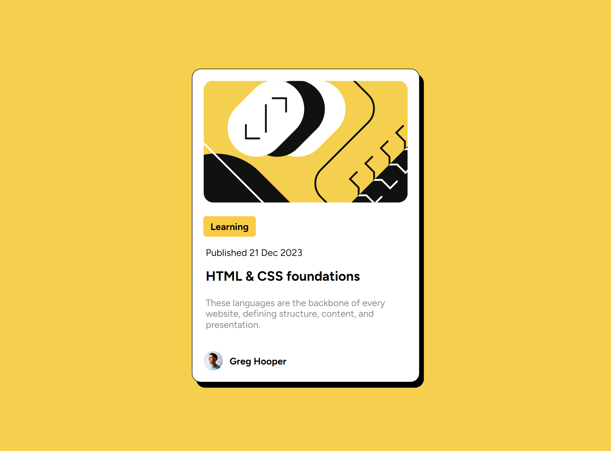

# Frontend Mentor - Blog preview card solution

This is a solution to the [Blog preview card challenge on Frontend Mentor](https://www.frontendmentor.io/challenges/blog-preview-card-ckPaj01IcS). Frontend Mentor challenges help you improve your coding skills by building realistic projects. 

## Table of contents

- [Overview](#overview)
  - [The challenge](#the-challenge)
  - [Screenshot](#screenshot)
  - [Links](#links)
- [My process](#my-process)
  - [Built with](#built-with)
  - [What I learned](#what-i-learned)
- [Author](#author)

## Overview

### The challenge

Users should be able to:

- See hover and focus states for all interactive elements on the page

### Screenshot

[screenshot-375px](screenshot-375px.png)

### Links

- Solution URL: [https://github.com/hamze-kabi/blog-preview-card/](https://github.com/hamze-kabi/blog-preview-card/)
- Live Site URL: [https://hamze-kabi.github.io/blog-preview-card/](https://hamze-kabi.github.io/blog-preview-card/)

## My process

### Built with

- HTML5
- CSS
- Flexbox

### What I learned
- Interactivity using javascript
- new css properties
- Amount of space occupied by each element using developer tools panel of google chrome browser
- Finding errors using developer tools panel of google chrome browser
- Positive effects of using relative lengths instead of absolute lengths

## Author

- Github account - [hamze-kabi](https://github.com/hamze-kabi)
